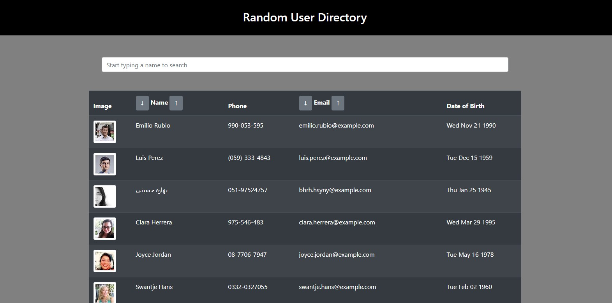

# User Directory

## Description

A React built randomly selected user directory that allows the page visitor to filter through the users by name or organize the user display by alphabetizing them.

## Usage

Starting on the deployed page, the list should automatically load in 100 users. If you click the buttons to the left or right of 'Name', the users will be organized in ascending or descending order by last name. The email organizes by first character of the email. As characters are typed in the search bar, the list shrinks to only find matches, regardless of upper or lowercase.

## Links

[Repo](https://github.com/najuasaad/user-directory)

[Deployed](https://najuasaad.github.io/user-directory/)

## Screenshots

A page load screenshot:

A screenshot of users organized by last name in ascending order:

A screenshot of users organized by email in descending order:
